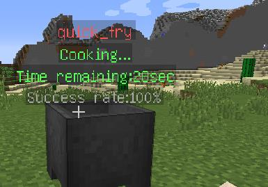
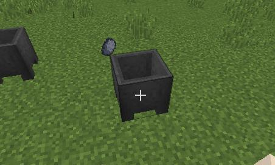

Languages: [中文](README.md) &nbsp;&nbsp;&nbsp;&nbsp;&nbsp;&nbsp; [English](README_EN.md)

# Cookery烹饪
 &nbsp; &nbsp; 

一个插件可以让玩家享受烹饪的乐趣。玩家放置一个大锅，并将特定的物品放入锅。接下来，他需要右键单击锅并选择烹饪模式。片刻后，
从大锅中喷出的食物

# 特点
* 支持自定义食谱
* 成功烹饪后，玩家可以获得经验并提升等级
* 升级后解锁新配方并提高烹饪成功率
* 游戏中gui显示所有配方
* 食用食物后获得可配置的药水效果
* 所有消息均可配置
* 使用Sqlite或mysql存储玩家的数据'

# 一个具体的例子

#### 第一步 把原料添加到锅中

#### 第二步 选择烹饪模式

#### 第三步 稍等片刻

#### 第四步 获得食物

